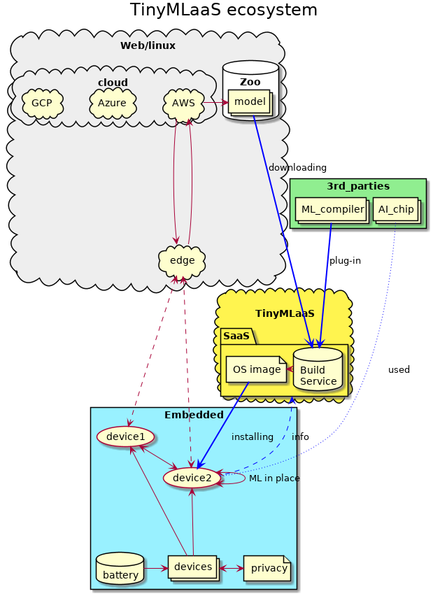

class: center, middle
# **MilliAI**
## Ericsson ONE Dragon's Den pitch

.footnote[Idea owner:[Hiroshi Doyu](hiroshi.doyu@ericsson.com)
Innovation Coach:[Hanieh Chaichi](hanieh.chaichi@ericsson.com)]

---
# Problem(1/2) Big data scalability
- IoT sensors generates Big data on Premise
- Big data == Raw (sensor) data
- IoT platform on Cloud collects Big data from IoT sensors
- Collecting Big data is expensive all the way
- IoT sensor <-> Gateway <-> MBS <-> Cloud <-> IoT platform <-> ML
- Overloaded IoT platforms cannot process exploding Big data

.footnote[[Edge computing cannot solve everything!!](#gap)]
---
# Problem(2/2) Privacy awareness
- IoT sensor generates Privacy data on Premise (e.g. face images)
- Privacy data == Raw data
- ML processes Private data on Cloud
- Customers are concerned about privacy issue on Cloud
- ML cannot run on IoT sensors, too big!!

.footnote[[Edge computing cannot solve everything!!](#gap)]

---
background-image: url(images/edgespectrum.png)
# Solution: tiny ML on IoT sensors
- Squeeze plain ML -> tiny ML
- Run tiny ML on IoT sensors
- Tiny ML processes Raw data on IoT sensors
- Size: Raw Big data >> Processed data (e.g. GB vs Byte)
- No privacy concerns in Processed data
- No network traffic unless needed (e.g. emergency)
- Processing on IoT sensors would offload overloaded IoT platform

???
For example,
- Dumb camera sends image to Cloud.
- This image may include someone's face.
- Face images are privacy dadta.
- OTOH, Smart camera detects # of people in a room.
- Smart camera sends 1 byte of # of people to Cloud
- 1 byte doesn't include privacy
- 1 byte saves network bandwidth, compared with video streaming
- 1 byte saves battery life, TX >> computing

---
# The Offer: TinyML as-a-Service
- as-a-Service == Cloud service
- Find appropriate ML on Zoo (model archive)
- Customize ML per IoT sensor to run
- Squeeze ML -> tinyML
- Orchestrate tinyML onto IoT sensor
- Establishing ecosystem with [AI chip](#aichip) vendors

.right[]

???
FIXME: resize
Not tied with any specific devices, but ecosystem oriented.

---
# Business Model
1. E/// charges Enterprises directly
 - subscription per IoT sensor
 - per data usage
 - per ML model
2. E/// charges Operator && Operator charges Enterprises
 - via IoT platform (e.g. IoT Accelerator)
 - TinyMLaaS == Optional service on IoTA

???
1. e.g. What's Tranxes' business, oneline
2. e.g. Telia case, smart building use

FIXME: Hanieh will provide fig here

---
# Market Potential (TAM)
- [**Shipments of TinyML Devices to Reach 2.5 Billion by 2030**](https://www.abiresearch.com/press/global-shipments-tinyml-devices-reach-25-billion-2030/)
- [**AI Chip Landscape**](#aichip)

???
Any IoT devices would be tinyML'rized.

Buy?

---
background-image: url(https://player.slideplayer.com/103/17536768/slides/slide_7.jpg)
# Future Area of Growth

???

- Smart building
 - Human distance under COVID-19
- Smart Home
- Smart Manufacturing
 - predictive maintenance
- Smart Logistics
 -  shipping container
- Smart City
 - Environmental measurement (low CO2)
- Smart Agriculture

---
# Market Traction
- Telia
- Traxens
- ABB
- Husquvarna
- Baltic Yacht
- City of Helsinki
- TinyML on Ardesco SDK
- LinuxFoundation AI wants TinyMLaaS under their incubation

---
class: bottom
background-image: url(images/lynred.png)
# MVP1: Telia / smart building
- occupancy management
- w/ smart camera
- w/ infrared camera
- privacy protection
- network bandwidth
- w/ battery powered

---
# MVP2: Tranxens / smart logistics
- shipping container management
- monitor state of a container
 - with temperature
 - with ambient sensor
 - with accelerometer
- monitor door open / closed
- beyond network coverage (e.g. on Sea)
- w/ battery powered

.bottom[]

---
# Execution Plan
- APR: Porting TinyML FWK on IoT sensor
- MAY: Implementing TinyMLaaS on Cloud
- JUN: Training model on Cloud
- AUG: Porting model onto IoT sensor
- SEP: Lab testing
- OCT: Feild testing
- NOV: Pioneers Nest

---
# Investment ask
- Porting TinyML FWK on IoT sensor: 6M
- Implementing TinyMLaaS on Cloud: 6M
- Training model on Cloud: 2M
- Porting model onto IoT sensor: 2M
- Project management: 6M
- Azure: 6M

---
# Risk Assessment
- TinyML cannot fit in IoT sensor (microcontroller)
- TinyML doesn't have enough accuracy
- TinyML runs too slow to serve.

???
TinyML is the trade-off between performance, accuracy and size.

---
# Core Team
- Hiroshi Doyu
 - Ericsson researcher, 20y of opensource hacker
- Mats Lundqvist
 - Global Partner Manager Division X at Telia
- Réda Khouani
 - Senior Manager Data Science & Analytics
- Hanieh Chaichi
 - Innovation Coach Ericsson ONE

FIXME: need more?

---
# Summary TBA
- Market and Business Potential
- Customer value and Adoption
- Product and Technology
- Commercial incl. Business Model
- Business Case Summary

---
class: center, middle
# Appendix

---
# FIXME: E/// blogs

---
name: gap
background-image: url(images/mlwebvsembedded.png)
## .right[Can't Edge computing solve?]

.footnote[Gap between **Edge (Linux)** and **Embedded (non-Linux)**]

---
name: aichip
background-image: url(https://raw.githubusercontent.com/basicmi/AI-Chip/master/resource/AI_Chip_Landscape_v0p7.png)
### [AI Chip Landscape](https://basicmi.github.io/AI-Chip/)

---
background-image: url(https://upload.wikimedia.org/wikipedia/commons/thumb/e/e9/Ericsson_logo.svg/500px-Ericsson_logo.svg.png)
