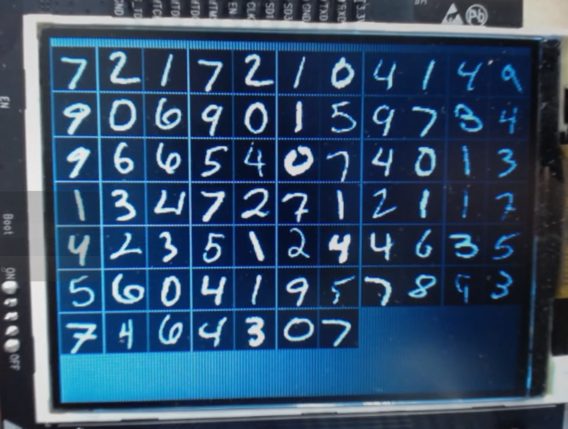
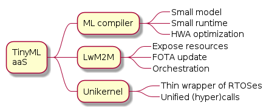
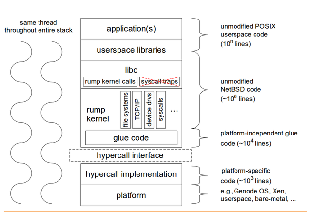
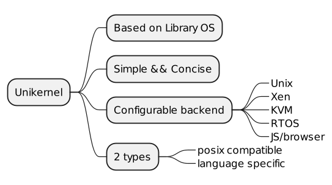
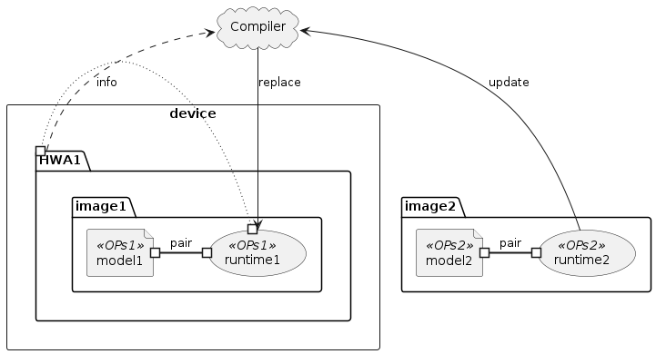
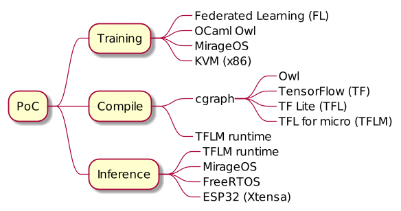
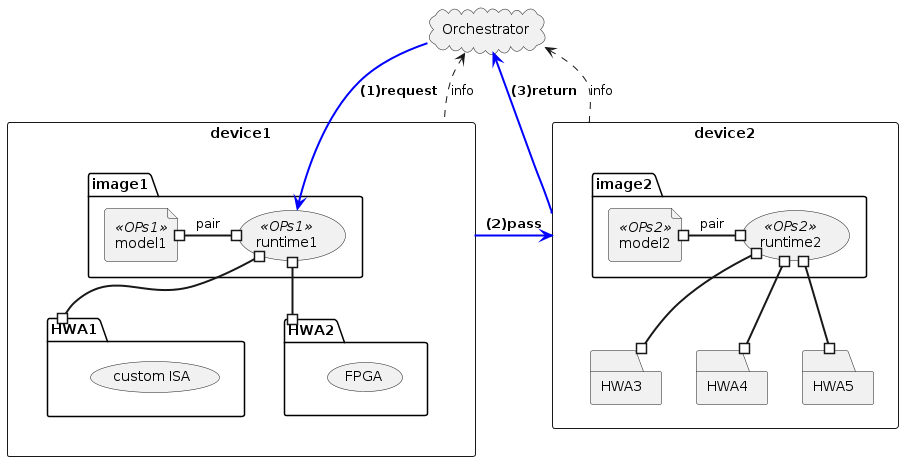
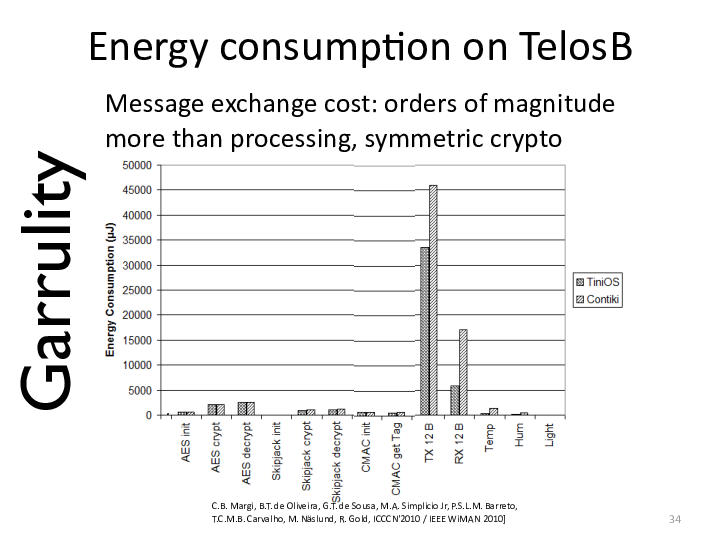
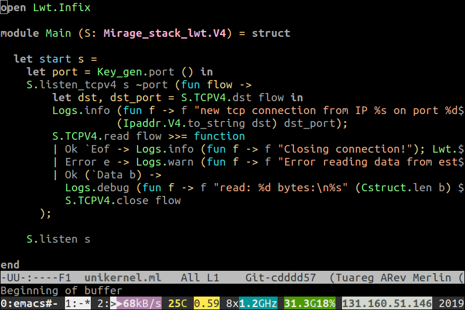

class: center, middle
# **TinyML** as-a-Service
Bring ML onto microcontollers seamlessly

.footnote[[Hiroshi Doyu](hiroshi.doyu@ericsson.com) 17th/OCT/2019]
???
# Distributed Machine Learning
# on
# Unikernel for IoT

#### TinyML as-a-Service
.footnote[[Hiroshi Doyu](hiroshi.doyu@ericsson.com) 17th/OCT/2019]

TinyML == ML on constrint IoT device

- How I tried to bring:
 - ML training & inference
 - in IoT environment.
- Some of them succeeded.
- Some didn't.
---
class: center, middle
# **Why no ML in IoT ?**

???
- I'll show ML inference running on MCU.
- You'll get some feeling of what it's about.
---
background-image: url(images/demo.png)
???
This is my setup.

Left top side:
# MNIST
- handwriting digit recognition
- ML hello world

Left middle && bottom:
# ESP32
- microcontroller
- backside LCD
- 520KB RAM
- 4MB FLASH ROM
- Linux cannot fit in
 - but Unikernl can.

Right side:
# DEMO
- Connected via WiFi
- send a bitmap
- classify into a digit
---
class: center, middle
<video width="560" height="420" controls>
    <source src="mnist.mp4" type="video/mp4">
</video>
# [MNIST inference on ESP32](https://play.ericsson.net/media/t/1_m56q17x5)

.footnote[https://youtu.be/6tJVtMrYGzA]
???
- Left upper
 - device console
- Left bottom
 - my laptop, sending a bitmap
- Right side
 - device screen
---
class: middle
# Outline
0. ~~Demo~~
1. **Problems**
  - **Edge Computing**
  - Web vs Embedded
  - ML environment
2. Proposal
3. Three Enablers
4. PoC
5. Conclusion
???
- We've done with demo.
- I'll define problems.
 - when you try to bring ML in IoT.
- Then, I will introduce our proposal
 - against the problem which we defined.
- Then, 3 enblers construct our proposal.
- Then, proof of concept.
- At Conclusion, we'll discuss further possibilities
- Let's start with "Demo".
# Next,
I will take a look at this problem from 3 aspects.
+ Edge Computing
+ Web vs Embedded
+ ML environment
Let's start with Edge computing.
---
background-image: url(images/ecosystem.png)
???
Traditionally,
- IoT devices communicate,
- directly with Cloud services.
- It was simple.
---
background-image: url(images/ecosystem_001.png)
???
- IoT is expanding.
- Scalability matters.
- Cloud may be too far & too slow.
---
background-image: url(images/ecosystem_002.png)
???
Let's introduce Edge computing:
- Cloud is expanding towards more Edge.
- This solved some latency issues.
- But not yet perfect.
---
background-image: url(images/ecosystem_006.png)

.footnote[ref: [energy costly transmission](#costlytx)]
???
There's some boudary, "On-premises"
- where devices reside,
- where data is generated.

# 5 Edge problems
- Privacy
 - customer doesn't want raw data leaving beyond their premises.
- Bandwidth
 - raw data is too big for narrow band.
- Latency
 - autonomous driving is a good example.
- Reliability
 - cars & ships can go beyond cellur coverage.

# Battery powered devices
- trasmitting data consumes more energy
 - than computation in place.
- processing data in place is cheaper.

---
background-image: url(images/ecosystem_007.png)
???
- More battery powered devices.
- Device would compute in place.
- Device would help each otehr by offloading tasks.
---
class: middle
# Outline
0. ~~Demo~~
1. **Problems**
   + ~~Edge Computing~~
   + **Web vs Embedded**
   + ML environment
2. Proposal
3. Three Enablers
4. PoC
5. Conclusion
???
This is about
- development environment.
---
background-image: url(images/ecosystem_008.png)

???
# There are 3 areas:
- Cloud computing
- Edge computing
- Embedded / IoT

---
background-image: url(images/ecosystem_011.png)
???
# In Cloud
- Linux runs
- Container
- microservies are dynamically deployed
- x86_64 / ARM64
- GB RAM / TB storage

From computer architecture perspective, same as Edge computing

# In Embedded
- variety of MCUs
- variety of RTOSes.
- 500KB SRAM / 2MB FLASH
- Linux cannot run on 500KB RAM.

## Embedded is totally different from Web.
## There are many dirversities in Embedded.
---
class: middle
# Outline
0. ~~Demo~~
1. **Problems**
   + ~~Edge Computing~~
   + ~~Web vs Embedded~~
   + **ML environment**
2. Proposal
3. Three Enablers
4. PoC
5. Conclusion
???
Next, let's look at ML environment.
---
background-image: url(images/ecosystem_013.png)
???
# From ML perspective,

## In Web,
- there are variety of python based frameworks,
- Cloud can train a ML model.
- Cloud can store a trained model in model Zoo.

## In embedded,
- python based frameworks are too heavy.
- Mainly because of no linux, no ML runtime.
---
background-image: url(images/summary-problem.png)
# Summary: Problems
---
class: middle
# Outline
0. ~~Demo~~
1. ~~Problems~~
2. **Proposal**
3. Three Enablers
4. PoC
5. Conclusion
???
- We defined a problem.
- Next, we'll propose our solution.
---
background-image: url(images/ecosystem_014.png)
???
- In Embedded,
 - No Linux
 - No ML
- Too big for IoT
---
# Squeeze ML
model & runtime
- per RAM / ROM / MCU / HWA
- per RTOS
- per connectivity
.right[]
???
- Like online piza order
---
background-image: url(images/ecosystem_015.png)
???
TinyML as-a-Service squeezes:
- model
- runtime
- wrap RTOS image
---
background-image: url(images/summary-proposal.png)
Proposal
# TinyML as-a-Service
---
class: middle
# Outline
0. ~~Demo~~
1. ~~Problems~~
2. ~~Proposal~~
3. **Three Enablers**
 - **Unikernel**
 - ML compiler
 - CoAP
4. PoC
5. Conclusion
.right[]
???
3 enblers for TinyML as-a-Service
---
background-image: url(images/dockerunikernel.jpg)
#Unikernel

.footnote[http://unikernel.org/files/2014-cacm-unikernels.pdf]
???
smaller than VM && Container
---
background-image: url(https://xenproject.org/wp-content/uploads/sites/79/2015/08/anyunirumpkernel.png)
# library Operating System (libOS)
.footnote[https://xenproject.org/wp-content/uploads/sites/79/2015/08/anyunirumpkernel.png]
???
specialization
---
## Internal
.top[]

.footnote[http://rumpkernel.org/]
???
hypercall implementation could adapt different backend easily
- feedback: simpler?
---
class: middle
# Summary: Unikernel
.top[]
## Can be a thin **wrapper** over various RTOSes?
.footnote[ref: 2 types, [highlevel language](#ocaml)]
---
# Outline
0. ~~Demo~~
1. ~~Problems~~
2. ~~Proposal~~
3. **Three Enablers**
 - ~~Unikernel~~
 - **ML compiler**
 - CoAP
4. PoC
5. Conclusion

.right[]
---
background-image: url(https://ucbrise.github.io/cs294-rise-fa16/assets/images/ml-lifecycle.jpg)
# 2 ML phases:

.footnote[https://ucbrise.github.io/cs294-rise-fa16/prediction_serving.html]
---
background-image: url(https://miro.medium.com/max/700/1*dYjDEI0mLpsCOySKUuX1VA.png)
# ML framework ==
## ML runtime +
back propagation

.footnote[https://devopedia.org/deep-learning-frameworks]
???
- many ML frameworks
- they were incompatible
- training & inference are done on the same framework.
---
background-image: url(images/nnvm_compiler_stack.png)
# Unified IR
.footnote[https://tvm.ai]
???
- each has its own computational graph.
- ONNX is considered as standard exchange format between frameworks.
- Compiler generates optimized code per backend.
---
background-image: url(images/cgraph.png)
## Computational graph (cgraph)
.footnote[serialization: [protobuf](https://developers.google.com/protocol-buffers), [flatbuf](https://google.github.io/flatbuffers/)]
???
- flow of operators with type info
- JSON <-> binary representation
---
# **General** vs **Special** purpose runtime
- General purpose is too big
 - All OPs built-in
- Model could be optimized **per** HWAs' OPs
- Runtime should implement **only** OPs, which model uses.

.right[]

.footnote[ref: [Trend of OpenISA](#openisa)]
???
https://tik-old.ee.ethz.ch/file//79a7dd6f6370f809e6180c0746232283/mobisys18-liu.pdf
---
background-image: url(images/summary-mlcompiler.png)
# Summary: ML compiler
???
---
# Outline
0. ~~Demo~~
1. ~~Problems~~
2. ~~Proposal~~
3. **Three Enablers**
 - ~~Unikernel~~
 - ~~ML compiler~~
 - **CoAP**
4. PoC
5. Conclusion

.right[]
---
background-image: url(images/coap.png)
.footnote[https://jaime.win/slides/IPSO2019.pdf]
???
- poor man's RESTful API
- expose a node info
 - needed to customise a model/runtime
- standard mechanism of updating firmware
---
background-image: url(images/summary-3enablers.png)
# Summary: Three Enablers
---
class: middle
# Outline
0. ~~Demo~~
1. ~~Problems~~
2. ~~Proposal~~
3. ~~Three Enablers~~
4. **PoC**
5. Conclusion
.right[]
---
background-image: url(images/mnist.png)
## **MNIST**: Handwriting digits recognition
### 60K images for training, 10K for testing
.footnote[https://www.katacoda.com/basiafusinska/courses/tensorflow-getting-started/tensorflow-mnist-beginner]
???
---
background-image: url(images/esp32-wrover.png)
#### ESP32 WROVER KIT
???
- Xtensa, 32bit
- 512kB SRAM
- 4MB FLASH
---
background-image: url(images/demo-ac.png)
???
- Distributed Training on Unikernel
- Compilation on host
- Inference on MCU
---
class: middle
# Outline
0. ~~Demo~~
1. ~~Problems~~
2. ~~Proposal~~
3. ~~Three Enablers~~
4. **PoC**
 - **Training**
 - Compile
 - Inference
5. Conclusion
.right[]
---
background-image: url(images/training-uc.png)
???
Typical distributed computing method
- share a model
- share a data
---
background-image: url(images/training-uc_001.png)
???
- If data is local,
- it's a federated learning.
---
background-image: url(images/training-uc_002.png)
.footnote[ref: [sequence diagram](#training_sq)]
???
- local raw data isn't leaked beyond premises.
---
background-image: url(images/training-uc_003.png)
???
- my simulation environment
- 4 unikernels run on KVM
- 1 paremeter server
- 3 workers
- Needed 100+MB RAM
 - Gave to run on MCU
---
class: middle
# Outline
0. ~~Demo~~
1. ~~Problems~~
2. ~~Proposal~~
3. ~~Three Enablers~~
4. **PoC**
 + ~~Training~~
 + **Compile**
 + Inference
5. Conclusion
.right[]
---
background-image: url(images/convert-uc.png)

???
- TFLM runtime is called via OCaml FFI.
 - FFI=Foreign Function Interface
---
class: middle
# Outline
0. ~~Demo~~
1. ~~Problems~~
2. ~~Proposal~~
3. ~~Three Enablers~~
4. **PoC**
 + ~~Training~~
 + ~~Compile~~
 + **Inference**
5. Conclusion
.right[]
---
background-image: url(images/demo-uc.png)
---
background-image: url(images/demo-sq.png)
---
background-image: url(images/size-comp.png)
# Binary Size
---
class: middle
# Outline
0. ~~Demo~~
1. ~~Problems~~
2. ~~Proposal~~
3. ~~Three Enablers~~
4. ~~PoC~~
5. **Conclusion**
---
**Done:** Demonstrated End-to-End **TinyML as-a-Service**
#### Next:
2. Add **orchestration** with CoAP?
3. Supprt **other** MCUs and/or **complicated** models?
4. (Distributed) training **on HWAs**?
5. Distributed inference
.right[]
---
background-image: url(images/elc.png)
---
class: center, middle
# Appendix
---
name: costlytx

.footnote[http://slides.cabo.space]
---
name: openisa
background-image: url(https://i1.wp.com/staceyoniot.com/wp-content/uploads/2019/10/Screen-Shot-2019-10-08-at-7.28.24-AM.png)
## Custom ISA, RISC-V && Arm

.footnote[https://staceyoniot.com/why-arm-opened-up-its-instruction-set-and-what-it-means-for-iot/]
---
name: training_sq
background-image: url(images/ps-sq.png)
---
class: center, middle
<video width="560" height="420" controls>
    <source src="fmnist.mp4" type="video/mp4">
</video>
# [Fashion MNIST from Zalando](https://play.ericsson.net/media/t/0_tdu20gt3)
.footnote[https://youtu.be/nl9rATQGB8Y]
---
name: ocaml
background-image: url(images/unikernel-mindmap.png)
#Type of Unikernel
???
- Safer not to use C
- language specific could be smaller
 - based of its packaging system
---
# MirageOS in OCaml
.bottom[]
???
Just feeling of abstructed API
- TCP listener
---
background-image: url(https://upload.wikimedia.org/wikipedia/commons/thumb/e/e9/Ericsson_logo.svg/500px-Ericsson_logo.svg.png)
