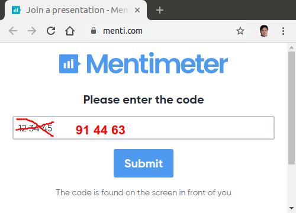

class: center, middle
# Distributed Machine Learning
# on
# Unikernel for IoT

.footnote[[Hiroshi Doyu](hiroshi.doyu@ericsson.com) 19th/SEP/2019]
---
class: middle
# Outline
1. Problem
2. Proposal
3. 3 Enablers
4. PoC
5. Summary
---
class: middle
# Outline
1. **Problem**
2. Proposal
3. 3 Enablers
4. PoC
5. Summary
---
background-image: url(images/ecosystem.png)
???
Traditionally devices communicate directly with Cloud services.
It was simple.
---
background-image: url(images/ecosystem_001.png)
???
Cloud is expanding towards Edge.
This solves latency issue.
---
background-image: url(images/ecosystem_002.png)
???
Still other issues:
Privacy: Avoid sending all raw data to be stored and processed on cloud servers.
Bandwidth: Reduce costs associated with transmitting all raw data to cloud services.
Latency: Reaction time is critical and cannot be dependent on a cloud connection.
Reliability: The ability to operate even when the cloud connection is interrupted.
---
background-image: url(images/realtime.png)
# when latency matter?
???

---
background-image: url(images/ecosystem_003.png)
???
Devices should compute by themselves.
Or help each other.
---
background-image: url(images/ecosystem_004.png)
???
In Cloud and Edge,
Linux runs && web development is used.
---
background-image: url(images/ecosystem_005.png)
???
In embedded,
there are variety of HWs && RTOS.
They are totally different from web development.
---
background-image: url(images/ecosystem_006.png)
???
In Web, container based solution
In Embedded, no unified solution
---
background-image: url(images/ecosystem_007.png)
???
From ML perspective,
in web, there are variety of python based frameworks,
in embedded, python based frameworks are too heavy.
---
background-image: url(images/summary-problem.png)
---
class: middle
# Outline
1. Problem
2. **Proposal**
3. 3 Enablers
4. PoC
5. Summary
---
background-image: url(images/ecosystem_008.png)
???
FIXME: TinyML definition
FIXME: TinyMLaaS definition
TinyML as-a-Service
which customize ML for embedded usecase.
---
background-image: url(images/summary-proposal.png)
# Proposal
---
class: middle
# Outline
1. Problem
2. Proposal
3. **3 Enablers**
4. PoC
5. Summary
---
background-image: url(images/tinyml-infra.png)
# 3 Enablers
---
# Outline
1. Problem
2. Proposal
3. **3 Enablers / Unikernel**
4. PoC
5. Summary

.bottom[]
---
background-image: url(https://zdnet1.cbsistatic.com/hub/i/r/2016/02/01/71e041f1-addd-4a9c-bc81-f73297f2dc6a/resize/770xauto/fffb0419c01c018b37d50605bdf341a3/dockerunikernel.jpg)
#Unikernel
???
smaller than VM && Container
---
background-image: url(https://xenproject.org/wp-content/uploads/sites/79/2015/08/anyunirumpkernel.png)
# library Operating System (libOS)
???
specialization
---
background-image: url(http://3.bp.blogspot.com/--jGFfze1gFw/VOXPZW6n5EI/AAAAAAAAFvA/efbK1sQbhEw/s1600/Selection_186.png)
## Internal
???
hypercall implementation could adapt different backend easily
---
background-image: url(images/unikernel-mindmap.png)
#Type of Unikernel
???
Safer not to use C
---
# Ocaml
.bottom[]
???
Just feeling of abstructed API
---
background-image: url(images/summary-unikernel.png)
# Summary: Unikernel
---
# Outline
1. Problem
2. Proposal
3. **3 Enablers / ML compiler**
4. PoC
5. Summary

.bottom[]
---
background-image: url(https://miro.medium.com/max/700/1*dYjDEI0mLpsCOySKUuX1VA.png)
# ML framework ==
## ML runtime
---
background-image: url(images/nnvm_compiler_stack.png)
# Unified IR
???
each has its own computation graph.
ONNX is considered as standard exchange format between frameworks.
Data scientists find the best algorithm.
Compiler generates optimized code per backend.
---
background-image: url(images/cgraph.png)
## Computational graph (cgraph)
---
background-image: url(http://136.225.130.103:8080/tflm/main_8cc_a655610549cf9e5304cd47ecae379d99f_cgraph.png)
# ML Runtime (inference)
---
background-image: url(images/summary-mlcompiler.png)
# Summary: ML compiler
???
FIXME: protobuf, flatbuf
---
background-image: url(images/summary-3enablers.png)
# Summary: 3 Enablers
???
FIXME: CoAP briefing
---
class: middle
# Outline
1. Problem
2. Proposal
3. 3 Enablers
4. **PoC**
5. Summary
---
background-image: url(https://miro.medium.com/max/2200/1*XdCMCaHPt-pqtEibUfAnNw.png)
## **MNIST**: Handwriting digits recognition
### 60K images for training, 10K for testing
???
.footnote[https://towardsdatascience.com/image-classification-in-10-minutes-with-mnist-dataset-54c35b77a38d]
---
background-image: url(images/demo-sq0.png)
---
background-image: url(images/esp32-wrover.png)
#### ESP32 WROVER KIT
---
background-image: url(images/demo-ac.png)
---
background-image: url(images/training-uc.png)
---
background-image: url(images/ps-sq.png)
---
background-image: url(images/convert-uc.png)
---
background-image: url(images/demo-uc.png)
???
FIXME: FFI?
---
background-image: url(images/demo-sq.png)
---
class: center, middle
# [Demo](https://play.ericsson.net/media/t/1_m56q17x5)
---
background-image: url(images/size-comp.png)
# Result

---
class: middle
# Outline
1. Problem
2. Proposal
3. 3 Enablers
4. PoC
5. **Summary**
---
class: middle
# Done
- Demonstrated possibility of End-to-End **TinyMLaaS**
 - Distributed training on Unikernels
 - Inference on Unikernel on microcontroller

# Next
- Squeeze more :)
 - Try **-lto**, link time optimization
- CoAP based orchestration
- Try with more complicated model
- HWA suppport

---
background-image: url(images/elc.png)

---
class: center, middle
# Send comments to [hiroshi.doyu@ericsson.com](hiroshi.doyu@ericsson.com)
# &&
.bottom[]
---

background-image: url(https://upload.wikimedia.org/wikipedia/commons/thumb/e/e9/Ericsson_logo.svg/500px-Ericsson_logo.svg.png)
