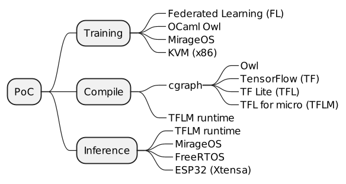

class: center, middle
# Distributed Machine Learning
# on
# Unikernel for IoT

#### TinyML as-a-Service
.footnote[[Hiroshi Doyu](hiroshi.doyu@ericsson.com) 11th/OCT/2019]

???
- How I tried to bring:
 - ML training & inference
 - in IoT environment.
- Some of them succeeded.
- Some didn't.
---
class: middle
# Outline
1. IoT Problems
2. Our Proposal
3. Three Enablers
4. Proof of Concept
5. Foreseen Opportunities
???
- At first, I will define IoT problems ML faces.
- Sencodary, I will introduce our proposal
 - against the problem we defined.
- Then, 3 enblers construct our proposal.
- Introduce Our proof of concept.
- Discuss further possibilities.
---
class: middle
# Outline
1. **IoT Problems**
2. Our Proposal
3. Three Enablers
4. Proof of Concept
5. Foreseen Opportunities
???
- Let's start with "IoT problems".
---
class: middle
# Outline
1. IoT Problems
   + **Edge Computing**
   + **Web vs Embedded**
   + **ML environment**
2. Our Proposal
3. Three Enablers
4. Proof of Concept
5. Foreseen Opportunities
???
I will take a look a this problem from 3 aspects.
+ **Edge Computing**
+ **Web vs Embedded**
+ **ML environment**
---
class: middle
# Outline
1. IoT Problems
   + **Edge Computing**
   + Web vs Embedded
   + ML environment
2. Our Proposal
3. Three Enablers
4. Proof of Concept
5. Foreseen Opportunities
---
background-image: url(images/ecosystem.png)
???
Traditionally,
- IoT devices communicate,
- directly with Cloud services.
- It was simple.
---
background-image: url(images/ecosystem_001.png)
???
- IoT is expanding.
- Scalability matters.
- Cloud may be too far & too slow.
---
background-image: url(images/ecosystem_002.png)
???
Let's introduce Edge computing:
- Cloud is expanding towards more Edge.
- This solved latency issue.
- But not yet perfect.
---
background-image: url(images/ecosystem_003.png)
???
There's some boudary.
- On-premises
 - where devices reside,
 - where data is generated.
---
background-image: url(images/ecosystem_004.png)
???
Privacy: Avoid sending all raw data to be stored and processed on cloud servers.
Bandwidth: Reduce costs associated with transmitting all raw data to cloud services.
Latency: Reaction time is critical and cannot be dependent on a cloud connection.
Reliability: The ability to operate even when the cloud connection is interrupted.
---
background-image: url(images/ecosystem_005.png)
???
- Easy to mange battery powered devices.
- trasmitting data consumes more energy than computation.
- processing data in place is better.
---
background-image: url(images/ecosystem_006.png)
???
5 Edge problems
---
background-image: url(images/ecosystem_007.png)
???
- Devices should compute in place.
- Neighbours should help each otehr.
---
class: middle
# Outline
1. IoT Problems
   + Edge Computing
   + **Web vs Embedded**
   + ML environment
2. Our Proposal
3. Three Enablers
4. Proof of Concept
5. Foreseen Opportunities
---
background-image: url(images/ecosystem_008.png)
???
In Cloud and Edge,
- where Linux runs && web development is used.
- Linux container
- microservies are dynamically deployed
- including Edge servers
- x86_64 / ARM64
- GB RAM / TB storage
---
background-image: url(images/ecosystem_009.png)
???
OTOH, in embedded,
- there are variety of MCUs
- there are variety of RTOSes.
- 500kB SRAM / 2MB FLASH
- Linux cannot run on 1MB RAM.
---
background-image: url(images/ecosystem_010.png)
???
Embedded is totally different from Web.
---
class: middle
# Outline
1. IoT Problems
   + Edge Computing
   + Web vs Embedded
   + **ML environment**
2. Our Proposal
3. Three Enablers
4. Proof of Concept
5. Foreseen Opportunities
---
background-image: url(images/ecosystem_011.png)
???
From ML perspective,
in web, there are variety of python based frameworks,
in embedded, python based frameworks are too heavy.
---
background-image: url(images/ecosystem_012.png)
---
background-image: url(images/summary-problem.png)
# Summary: IoT Problems
---
class: middle
# Outline
1. IoT Problems
2. **Our Proposal**
3. Three Enablers
4. Proof of Concept
5. Foreseen Opportunities
---
background-image: url(images/ecosystem_012.png)
???
- Cloud does training
- generates model.
- model is too big for IoT.
- (Cloud) runtime is too big for IoT.
---
# Squeeze ML for
- model / runtime
- RAM / ROM / MCU
- RTOS
- connectivity

.right[]
---
background-image: url(images/ecosystem_013.png)
???
Squeeze
- model
- runtime
- wrap RTOS image
---
background-image: url(images/summary-proposal.png)
Our Proposal
# TinyML as-a-Service
---
class: middle
# Outline
1. IoT Problems
2. Our Proposal
3. **Three Enablers**
 - Unikernel
 - ML compiler
 - CoAP
4. Proof of Concept
5. Foreseen Opportunities
---
# Outline
1. IoT Problems
2. Our Proposal
3. **Three Enablers**
 - **Unikernel**
 - ML compiler
 - CoAP
4. Proof of Concept
5. Foreseen Opportunities
.right[]
---
background-image: url(https://zdnet1.cbsistatic.com/hub/i/r/2016/02/01/71e041f1-addd-4a9c-bc81-f73297f2dc6a/resize/770xauto/fffb0419c01c018b37d50605bdf341a3/dockerunikernel.jpg)
#Unikernel
.footnote[http://unikernel.org/files/2014-cacm-unikernels.pdf]
???
smaller than VM && Container
---
background-image: url(https://xenproject.org/wp-content/uploads/sites/79/2015/08/anyunirumpkernel.png)
# library Operating System (libOS)
.footnote[https://xenproject.org/wp-content/uploads/sites/79/2015/08/anyunirumpkernel.png]
???
specialization
---
## Internal
.top[]

.footnote[http://rumpkernel.org/]
???
hypercall implementation could adapt different backend easily
---
background-image: url(images/unikernel-mindmap.png)
#Type of Unikernel
???
Safer not to use C
---
# Ocaml
.bottom[]
???
Just feeling of abstructed API
---
class: middle
# Summary: Unikernel
.top[]
## Can be a thin **wrapper** over various RTOSes?

---
# Outline
1. IoT Problems
2. Our Proposal
3. **Three Enablers**
 - Unikernel
 - **ML compiler**
 - CoAP
4. Proof of Concept
5. Foreseen Opportunities

.right[]
---
background-image: url(https://miro.medium.com/max/700/1*dYjDEI0mLpsCOySKUuX1VA.png)
# ML framework ==
## ML runtime +
back probagation
.footnote[https://devopedia.org/deep-learning-frameworks]
---
background-image: url(images/nnvm_compiler_stack.png)
# Unified IR
.footnote[https://tvm.ai]
???
each has its own computational graph.
ONNX is considered as standard exchange format between frameworks.
Data scientists find the best algorithm.
Compiler generates optimized code per backend.
---
background-image: url(images/cgraph.png)
## Computational graph (cgraph)
.footnote[serialization: protobuf, flatbuf]
???
JSON <-> binary representation
---
background-image: url(http://136.225.130.103:8080/tflm/main_8cc_a655610549cf9e5304cd47ecae379d99f_cgraph.png)
# ML Runtime (inference)
.footnote[model ops == runtime ops]
---
background-image: url(images/summary-mlcompiler.png)
# Summary: ML compiler
???
---
# Outline
1. IoT Problems
2. Our Proposal
3. **Three Enablers**
 - Unikernel
 - ML compiler
 - **CoAP**
4. Proof of Concept
5. Foreseen Opportunities

.right[]
---
background-image: url(images/coap.png)
### CoAP
.footnote[https://jaime.win/slides/IPSO2019.pdf]
???
poor man's RESTful API
---
background-image: url(images/summary-3enablers.png)
# Summary: Three Enablers
???
CoAP is Constraint Application Protocol.
Concept: Bring web to IoT as M2M communication.
---
class: middle
# Outline
1. IoT Problems
2. Our Proposal
3. Three Enablers
4. **Proof of Concept**
5. Foreseen Opportunities
---
class: middle
# Outline
1. IoT Problems
2. Our Proposal
3. Three Enablers
4. **Proof of Concept**
5. Foreseen Opportunities
.right[]
---
background-image: url(https://miro.medium.com/max/2200/1*XdCMCaHPt-pqtEibUfAnNw.png)
## **MNIST**: Handwriting digits recognition
### 60K images for training, 10K for testing
???
.footnote[https://towardsdatascience.com/image-classification-in-10-minutes-with-mnist-dataset-54c35b77a38d]
---
background-image: url(images/esp32-wrover.png)
#### ESP32 WROVER KIT
---
background-image: url(images/demo-ac.png)
---
class: middle
# Outline
1. IoT Problems
2. Our Proposal
3. Three Enablers
4. **Proof of Concept**
 + **tarining**
 + compile
 + inference
5. Foreseen Opportunities
.right[]
---
background-image: url(images/training-uc.png)
---
background-image: url(images/training-uc_001.png)
---
background-image: url(images/training-uc_002.png)
---
background-image: url(images/training-uc_003.png)
---
background-image: url(images/ps-sq.png)
---
# FIXME: size of model & executable

---
class: middle
# Outline
1. IoT Problems
2. Our Proposal
3. Three Enablers
4. **Proof of Concept**
 + tarining
 + **compile**
 + inference
5. Foreseen Opportunities
.right[]
---
background-image: url(images/convert-uc.png)
???
TFLM runtime is called via OCaml FFI.
FFI=Foreign Function Interface
---
# FIXME: size of model & image before/after

---
class: middle
# Outline
1. IoT Problems
2. Our Proposal
3. Three Enablers
4. **Proof of Concept**
 + tarining
 + compile
 + **inference**
5. Foreseen Opportunities
.right[]
---
background-image: url(images/demo-uc.png)
---
background-image: url(images/demo-sq.png)
---
class: center, middle
# [Demo](https://play.ericsson.net/media/t/1_m56q17x5)
---
class: center, middle
<video width="560" height="420" controls>
    <source src="http://136.225.130.103:8080/elc2019/mnist.mp4" type="video/mp4">
</video>
# [MNIST inference on ESP32](https://play.ericsson.net/media/t/1_m56q17x5)
---
class: center, middle
<video width="560" height="420" controls>
    <source src="http://136.225.130.103:8080/elc2019/fmnist.mp4" type="video/mp4">
</video>
# [Fashion MNIST from Zalando](https://play.ericsson.net/media/t/0_tdu20gt3)
---
background-image: url(images/size-comp.png)
# Result

---
class: middle
# Outline
1. IoT Problems
2. Our Proposal
3. Three Enablers
4. Proof of Concept
5. **Foreseen Opportunities**
---
# Done
+ Demonstrated End-to-End TinyML as-a-Service

# Next
+ Add **frontend**, as-a-Service
+ Supprt **other** MCUs
+ Support **complicated** models
 + Object recognition?
+ Add **orchestration** with CoAP
+ (Distributed) training **on MCU**?
+ **Distributed** inference (on MCU)?

# Any suggestions?
---
background-image: url(images/elc.png)
---
background-image: url(https://upload.wikimedia.org/wikipedia/commons/thumb/e/e9/Ericsson_logo.svg/500px-Ericsson_logo.svg.png)
