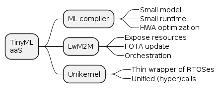

class: center, middle
# **TinyML** as-a-Service
Bring ML onto microcontollers seamlessly

.footnote[[Hiroshi Doyu](hiroshi.doyu@ericsson.com) 17th/OCT/2019]
???
# Distributed Machine Learning
# on
# Unikernel for IoT

#### TinyML as-a-Service
.footnote[[Hiroshi Doyu](hiroshi.doyu@ericsson.com) 17th/OCT/2019]

- How I tried to bring:
 - ML training & inference
 - in IoT environment.
- Some of them succeeded.
- Some didn't.
---
background-image: url(images/demo.png)
???

---
class: center, middle
<video width="560" height="420" controls>
    <source src="mnist.mp4" type="video/mp4">
</video>
# [MNIST inference on ESP32](https://play.ericsson.net/media/t/1_m56q17x5)
.footnote[]
---
class: middle
# Outline
1. IoT Problems
2. Our Proposal
3. Three Enablers
4. Proof of Concept
5. Foreseen Opportunities
...
???
- At first, I will define IoT problems ML faces.
- Sencodary, I will introduce our proposal
 - against the problem we defined.
- Then, 3 enblers construct our proposal.
- I'll explain our proof of concept.
- At least, I'll discuss further possibilities
---
class: middle
# Outline
1. **IoT Problems**
2. Our Proposal
3. Three Enablers
4. Proof of Concept
5. Foreseen Opportunities
???
- Let's start with "IoT problems".
---
class: middle
# Outline
1. IoT Problems
   + **Edge Computing**
   + **Web vs Embedded**
   + **ML environment**
2. Our Proposal
3. Three Enablers
4. Proof of Concept
5. Foreseen Opportunities
???
I will take a look a this problem from 3 aspects.
+ **Edge Computing**
+ **Web vs Embedded**
+ **ML environment**
---
class: middle
# Outline
1. IoT Problems
   + **Edge Computing**
   + Web vs Embedded
   + ML environment
2. Our Proposal
3. Three Enablers
4. Proof of Concept
5. Foreseen Opportunities
---
background-image: url(images/ecosystem.png)
???
Traditionally,
- IoT devices communicate,
- directly with Cloud services.
- It was simple.
---
background-image: url(images/ecosystem_001.png)
???
- IoT is expanding.
- Scalability matters.
- Cloud may be too far & too slow.
---
background-image: url(images/ecosystem_002.png)
???
Let's introduce Edge computing:
- Cloud is expanding towards more Edge.
- This solved some latency issues.
- But not yet perfect.
???
background-image: url(images/ecosystem_003.png)
???
There's some boudary.
- On-premises
 - where devices reside,
 - where data is generated.
???
background-image: url(images/ecosystem_004.png)
squashed into the following
???
- Privacy
 - customer doesn't want raw data leaving beyond their premises.
- Bandwidth
 - raw data is too big for narrow band.
- Latency
 - autonomous driving is a good example.
- Reliability
 - cars & ships can go beyond cellur coverage.
???
background-image: url(images/ecosystem_005.png)
squashed into the following
???
- Without power cable,
 - it's easy to mange battery powered devices.
- trasmitting data consumes more energy than computation, in place.
- processing data in place is better.
---
background-image: url(images/ecosystem_006.png)
???
To summarize
- 5 Edge problems
---
background-image: url(images/ecosystem_007.png)
???
- Devices should compute in place.
 - Good for battery powered IoT devices.
- Neighbours should help each otehr.
---
class: middle
# Outline
1. IoT Problems
   + Edge Computing
   + **Web vs Embedded**
   + ML environment
2. Our Proposal
3. Three Enablers
4. Proof of Concept
5. Foreseen Opportunities
???
This is about
- development environment.
---
background-image: url(images/ecosystem_007.png)
???
There are 3 areas:
- Cloud
- Edge
- Embedded
???
background-image: url(images/ecosystem_008.png)
squashed into the following
???
In Cloud and Edge belong to web development.
- where Linux runs
- Linux container
- microservies are dynamically deployed
- including Edge servers
- x86_64 / ARM64
- GB RAM / TB storage
???
background-image: url(images/ecosystem_009.png)
squashed into the following
???
OTOH, in embedded,
- there are variety of MCUs
- there are variety of RTOSes.
- 500kB SRAM / 2MB FLASH
- Linux cannot run on 1MB RAM.
---
background-image: url(images/ecosystem_010.png)
???
- Embedded is totally different from Web.
- There are many dirversities in Embedded.
---
class: middle
# Outline
1. IoT Problems
   + Edge Computing
   + Web vs Embedded
   + **ML environment**
2. Our Proposal
3. Three Enablers
4. Proof of Concept
5. Foreseen Opportunities
???
Next, let's look at ML environment.
???
background-image: url(images/ecosystem_011.png)
squash into the following
???
From ML perspective,
- in Web,
 - there are variety of python based frameworks,
- in embedded,
 - python based frameworks are too heavy.
---
background-image: url(images/ecosystem_012.png)
???
- Cloud can train a ML model.
- Cloud can store a trained model in model Zoo.
- But Embeded cannot use this model,
- Mainly because of no linux, no ML runtime.
---
background-image: url(images/summary-problem.png)
# Summary: IoT Problems
---
class: middle
# Outline
1. IoT Problems
2. **Our Proposal**
3. Three Enablers
4. Proof of Concept
5. Foreseen Opportunities
???
- We defined a problem.
- Next, we'll propose our solution.
---
background-image: url(images/ecosystem_013.png)
???
- In Embedded,
 - No Linux
 - No ML
- Too big for IoT
---
# Squeeze ML
model & runtime
- per RAM / ROM / MCU
- per RTOS
- per connectivity
.right[]
???
- Like online piza order
---
background-image: url(images/ecosystem_014.png)
???
TinyML as-a-Service squeezes:
- model
- runtime
- wrap RTOS image
---
background-image: url(images/summary-proposal.png)
Our Proposal
# TinyML as-a-Service
---
class: middle
# Outline
1. IoT Problems
2. Our Proposal
3. **Three Enablers**
4. Proof of Concept
5. Foreseen Opportunities
???
3 enblers for TinyML as-a-Service
---
class: middle
# Outline
1. IoT Problems
2. Our Proposal
3. **Three Enablers**
 - **Unikernel**
 - **ML compiler**
 - **CoAP**
4. Proof of Concept
5. Foreseen Opportunities
.right[]
---
class: middle
# Outline
1. IoT Problems
2. Our Proposal
3. **Three Enablers**
 - **Unikernel**
 - ML compiler
 - CoAP
4. Proof of Concept
5. Foreseen Opportunities
.right[]
---
background-image: url(https://zdnet1.cbsistatic.com/hub/i/r/2016/02/01/71e041f1-addd-4a9c-bc81-f73297f2dc6a/resize/770xauto/fffb0419c01c018b37d50605bdf341a3/dockerunikernel.jpg)
#Unikernel
.footnote[http://unikernel.org/files/2014-cacm-unikernels.pdf]
???
smaller than VM && Container
---
background-image: url(https://xenproject.org/wp-content/uploads/sites/79/2015/08/anyunirumpkernel.png)
# library Operating System (libOS)
.footnote[https://xenproject.org/wp-content/uploads/sites/79/2015/08/anyunirumpkernel.png]
???
specialization
---
## Internal
.top[]

.footnote[http://rumpkernel.org/]
???
hypercall implementation could adapt different backend easily
- feedback: simpler?
---
background-image: url(images/unikernel-mindmap.png)
#Type of Unikernel
???
- Safer not to use C
- language specific could be smaller
 - based of its packaging system
---
# Ocaml
.bottom[]
???
Just feeling of abstructed API
- TCP listener
---
class: middle
# Summary: Unikernel
.top[]
## Can be a thin **wrapper** over various RTOSes?
---
# Outline
1. IoT Problems
2. Our Proposal
3. **Three Enablers**
 - Unikernel
 - **ML compiler**
 - CoAP
4. Proof of Concept
5. Foreseen Opportunities

.right[]
---
background-image: url(https://ucbrise.github.io/cs294-rise-fa16/assets/images/ml-lifecycle.jpg)
# 2 ML phases:

.footnote[https://ucbrise.github.io/cs294-rise-fa16/prediction_serving.html]
---
background-image: url(https://miro.medium.com/max/700/1*dYjDEI0mLpsCOySKUuX1VA.png)
# ML framework ==
## ML runtime +
back propagation

.footnote[https://devopedia.org/deep-learning-frameworks]
???
- many ML frameworks
- they were incompatible
- training & inference are done on the same framework.
---
background-image: url(images/nnvm_compiler_stack.png)
# Unified IR
.footnote[https://tvm.ai]
???
- each has its own computational graph.
- ONNX is considered as standard exchange format between frameworks.
- Compiler generates optimized code per backend.
---
background-image: url(images/cgraph.png)
## Computational graph (cgraph)
.footnote[serialization: protobuf, flatbuf]
???
- flow of operators with type info
- JSON <-> binary representation
---
# generate smaller Runtime
- A general purpose runtime is too big. (#FIXME:  size info)
 - all ops built-in
- A model is optimized per some HWAs.
 - not all HWAs
- A runtime should have only ops
 - which a model uses.
  - inspect a model ops
  - build only those ops in

.footnote[FIXME:  insert ops selection fig]
---
background-image: url(images/summary-mlcompiler.png)
# Summary: ML compiler
???
---
# Outline
1. IoT Problems
2. Our Proposal
3. **Three Enablers**
 - Unikernel
 - ML compiler
 - **CoAP**
4. Proof of Concept
5. Foreseen Opportunities

.right[]
---
background-image: url(images/coap.png)
.footnote[https://jaime.win/slides/IPSO2019.pdf]
???
- poor man's RESTful API
- expose a node info
 - needed to customise a model/runtime
- standard mechanism of updating firmware
---
background-image: url(images/summary-3enablers.png)
# Summary: Three Enablers
---
class: middle
# Outline
1. IoT Problems
2. Our Proposal
3. Three Enablers
4. **Proof of Concept**
5. Foreseen Opportunities
---
class: middle
# Outline
1. IoT Problems
2. Our Proposal
3. Three Enablers
4. **Proof of Concept**
5. Foreseen Opportunities
.right[]
---
background-image: url(images/mnist.png)
## **MNIST**: Handwriting digits recognition
### 60K images for training, 10K for testing
.footnote[https://www.katacoda.com/basiafusinska/courses/tensorflow-getting-started/tensorflow-mnist-beginner]
???
---
background-image: url(images/esp32-wrover.png)
#### ESP32 WROVER KIT
???
- Xtensa, 32bit
- 512kB SRAM
- 4MB FLASH
---
background-image: url(images/demo-ac.png)
???
- Distributed Training on Unikernel
- Compilation on host
- Inference on MCU
---
class: middle
# Outline
1. IoT Problems
2. Our Proposal
3. Three Enablers
4. **Proof of Concept**
 + **tarining**
 + compile
 + inference
5. Foreseen Opportunities
.right[]
---
background-image: url(images/training-uc.png)
???
Typical distributed computing method
- share a model
- share a data
---
background-image: url(images/training-uc_001.png)
???
- If data is local,
- it's a federated learning.
---
background-image: url(images/training-uc_002.png)
.footnote[[ref: sequence diagram](#training_sq)]
???
- local raw data isn't leaked beyond premises.
---
background-image: url(images/training-uc_003.png)
???
- my simulation environment
- 4 unikernels run on KVM
- 1 paremeter server
- 3 workers
- Needed 100+MB RAM
 - Gave to run on MCU
---
class: middle
# Outline
1. IoT Problems
2. Our Proposal
3. Three Enablers
4. **Proof of Concept**
 + tarining
 + **compile**
 + inference
5. Foreseen Opportunities
.right[]
---
background-image: url(images/convert-uc.png)

.footnote[FIXME: size of cgraphs]
???
- TFLM runtime is called via OCaml FFI.
 - FFI=Foreign Function Interface
---
class: middle
# Outline
1. IoT Problems
2. Our Proposal
3. Three Enablers
4. **Proof of Concept**
 + tarining
 + compile
 + **inference**
5. Foreseen Opportunities
.right[]
---
background-image: url(images/demo-uc.png)
---
background-image: url(images/demo-sq.png)
---
background-image: url(images/size-comp.png)
# Result
---
class: middle
# Outline
1. IoT Problems
2. Our Proposal
3. Three Enablers
4. Proof of Concept
5. **Foreseen Opportunities**
---
Demonstrated End-to-End **TinyML as-a-Service**
### Next
+ Add **frontend**, as-a-Service
+ Supprt **other** MCUs & **complicated** models
+ Add **orchestration** with CoAP
+ (Distributed) training **on MCU**?
+ **Distributed** inference (on MCU?)
.right[]
## Any suggestions?
---
background-image: url(images/elc.png)
---
class: center, middle
# Appendix
---
name: training_sq
background-image: url(images/ps-sq.png)
---
class: center, middle
<video width="560" height="420" controls>
    <source src="fmnist.mp4" type="video/mp4">
</video>
# [Fashion MNIST from Zalando](https://play.ericsson.net/media/t/0_tdu20gt3)
.footnote[https://youtu.be/nl9rATQGB8Y]
---
background-image: url(https://upload.wikimedia.org/wikipedia/commons/thumb/e/e9/Ericsson_logo.svg/500px-Ericsson_logo.svg.png)
